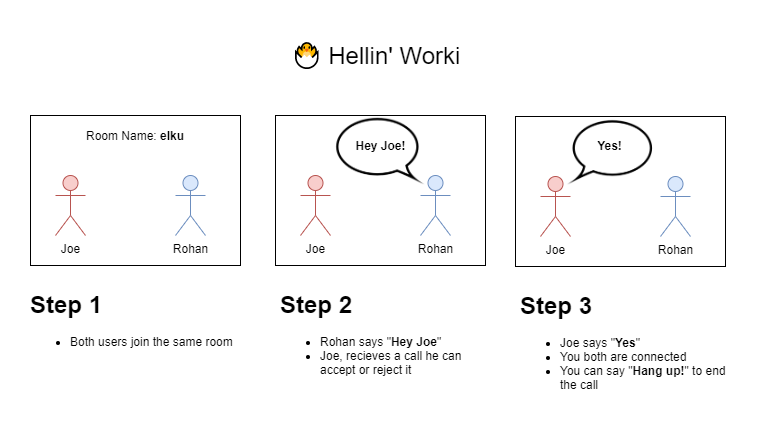
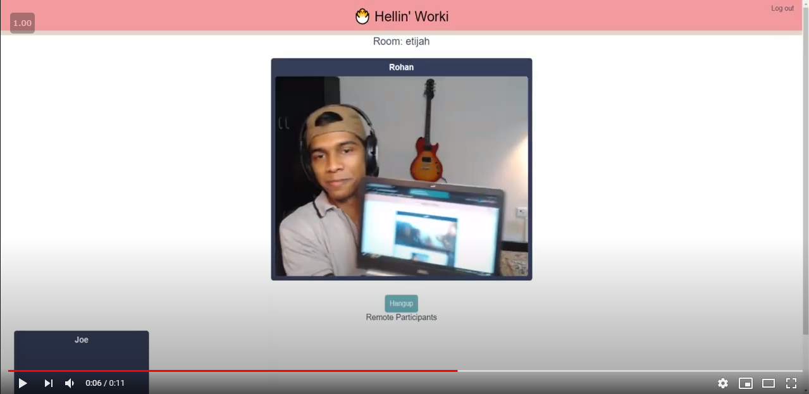
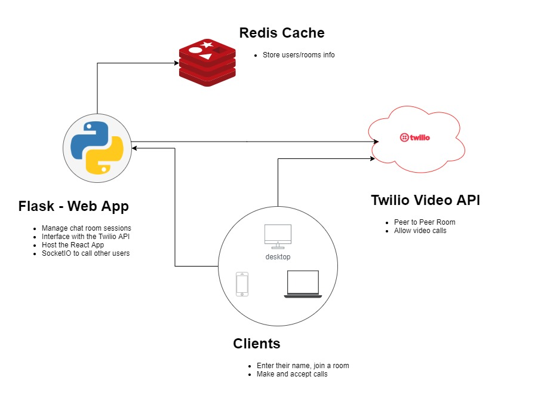
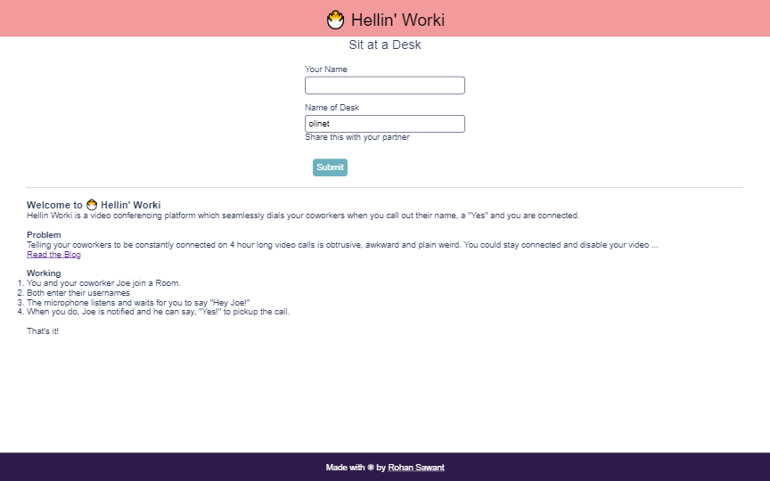
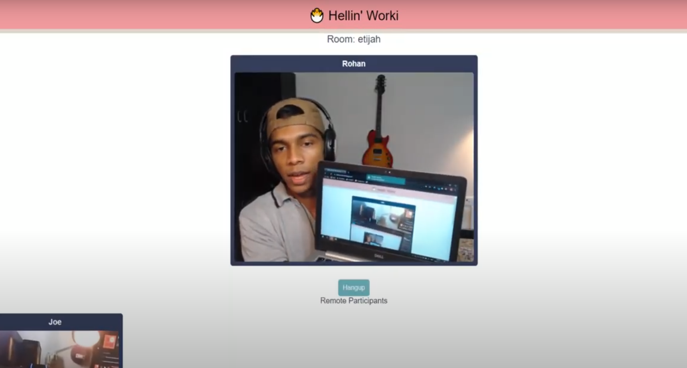

# 🐣 Hellin' Worki - Now, Joe's just a shout away

Hellin' Worki is a video conferencing platform which seamlessly dials your coworkers when you call out their name, a  "Yes" and you are connected. 



## Problem

Telling your coworkers to be constantly connected on 4 hour long video calls is obtrusive, awkward and plain weird. You could stay connected and disable your video, but then they would still hear your chair squeak, the pigeons out the window and the traffic outside. Nothing quite emulates the comradery of your cozy old office, does it?

Nothing quite replaces sitting across the table from each other and collaborating, does it? 

Nope, but Hellin' Worki changes that. 

## Working

1. You and your coworker Joe join a Room.
2. Both enter their names
3. The microphone listens and waits for you to say "**Hey Joe**!"
4. When you do, Joe is notified and he can say, "**Yes!**" to pickup the call.

That's it!

## Demo

[](https://youtu.be/K1QOSTZRU1o)

## Tech Stack

* Video Conferencing - [Twilio Video API](https://www.twilio.com/docs/video)

* Speech Recognition - [Annyang](https://www.talater.com/annyang/) 

* Backend - [Flask](https://flask.palletsprojects.com/en/1.1.x/) - Python

* Frontend - [ReactJS](https://reactjs.org/) - JavaScript

  

## How to Run

1. Create the .env file. (Read more, in the Appendix)

2. `docker-compose up --build` 

3. Visit http://localhost:5000!

   

## Infrastructure 



## Advantages

* Calling out your coworker by their names is natural, uninstructive and seamless
* Responding to calls is as simple and easy
* You don't have to stay connected to the video call for hours on end.
* Your privacy is maintained as you are connected only when you respond.

## Screenshots

> Home Page



> Empty Room


> Incoming Call


> Call in Progress



## Why can I just run the live Demo?  😑

Well, Twilio Video costs real money *(0.01$ per participant/minute)* every time someone makes a call, and hosting it for free would not be cheap. So...yeah. 

But, hey! If you need help setting this up send me an email!

## License

Apache License 2.0 

A permissive license whose main conditions require preservation of copyright and license notices. Contributors provide an express grant of patent rights. Licensed works, modifications, and larger works may be distributed under different terms and without source code.

## References

* https://www.twilio.com/blog/video-chat-react-hooks

## Appendix

#### 1. Setup

We need 5 things, add these in an `.env` file like this

```bash
TWILIO_ACCOUNT_SID=XXXXXXXXXXX
TWILIO_API_KEY=XXXXXXXXXXXXXXX
TWILIO_API_SECRET=XXXXXXXXXXXX
TWILIO_AUTH_TOKEN=XXXXXXXXXXXX
```


* Get the API Key and Secret from here - https://www.twilio.com/console/project/api-keys
* Get the Account SID and Auth. Toke here - https://www.twilio.com/console

#### 2. Hellin' Worki? What's with the name, Rohan?

I used  a random name generator and it generated a random name. 

